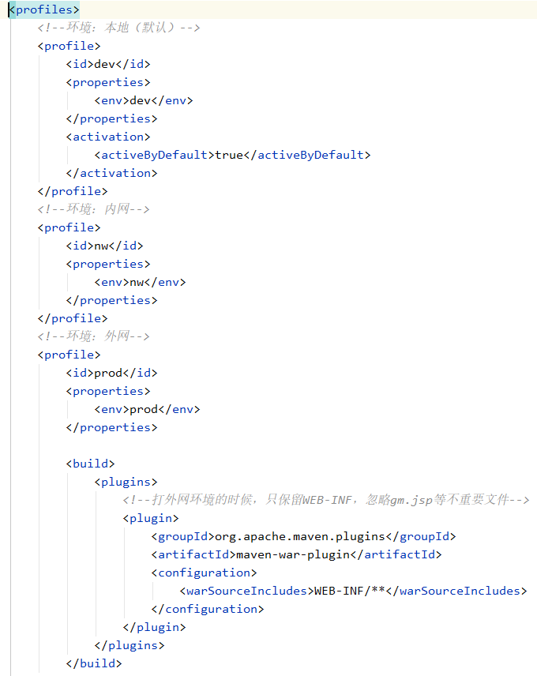
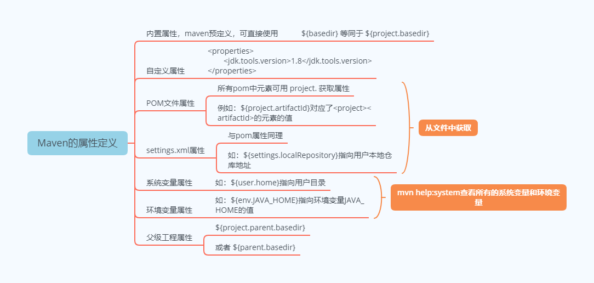
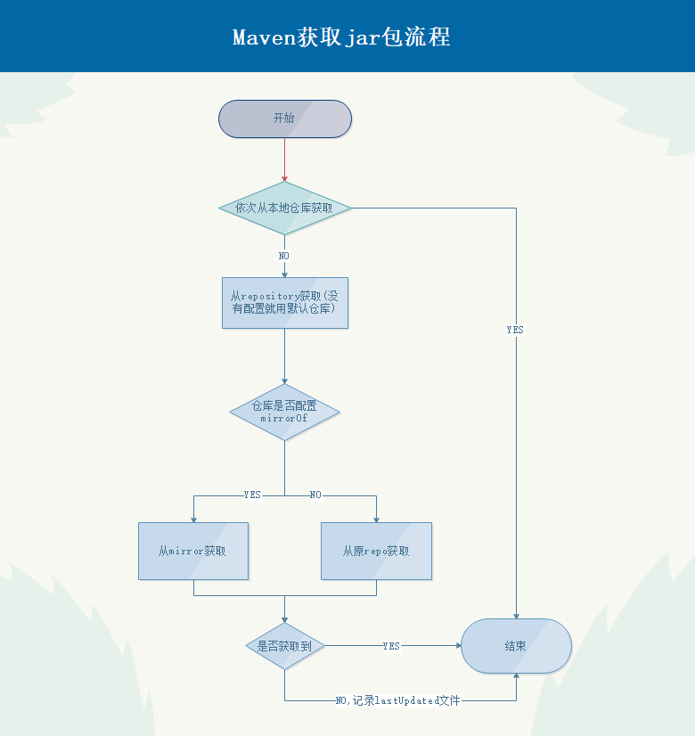

# Maven的原理与技巧

## 背景

目前项目中主流的都是使用maven等构建工具，当然在使用过程中也会遇到各种各样的疑惑或问题，比如：

- maven生命周期到底有啥用
- jar包下载不了怎么办
- 不知道配置怎么配，下载jar包的顺序是什么
- jar包冲突又是怎么解决

问的人多了，也就形成了大家的共性问题，这里基于这些问题，本文着重梳理下maven的基本原理，并对一些常见问题做一些总结。

## Maven能干嘛？

maven并不是第一个做构建工具的，在它之前还有ant等其他的工具，再早之前就是纯手工自己写脚本进行打包，这种方式就非常的原始了。几种方式都有各自的弊端，这里我就不一一赘述了。这里先简单介绍下maven能干啥：

- 依赖管理：定义了jar包各版本之间的依赖关系
- 生命周期管理：规范化构建的各个阶段，也是为了便于插件的运行
- 仓库管理：建设了jar包仓库，管理所有的开源jar，同时可自架设私有仓库
- 约定大于配置：标准的目录结构（web）、默认的输出位置（target）、默认的命令执行流程、预定义的生命周期阶段
- 项目信息管理：项目的说明、版本等信息

Tips:Maven虽然是java实现的，但并非java独有。它是一个项目管理工具，也可用于构建其他语言的项目，如C#、Ruby、Scala等

## Maven生命周期有啥用？

Maven有三套相互独立的生命周期，分别是clean、default和site。每个生命周期包含一些阶段（phase），阶段是有顺序的，后面的阶段依赖于前面的阶段。

各个生命周期相互独立，但一个生命周期的阶段前后依赖。


**例子：**

- mvn clean 调用clean生命周期的clean阶段，实际执行pre-clean和clean阶段
- mvn test 调用default生命周期的test阶段，实际执行test以及之前所有阶段
- mvn clean install 调用clean生命周期的clean阶段和default的install阶段，实际执行pre-clean和clean，install以及之前所有阶段

具体Maven生命周期有啥用？这是和Maven的命令以及Maven的插件机制有关。

## Maven的命令格式

方式1：mvn compile:compile 【指名道姓】

- mvn <plugin-group-id>:<plugin-artifact-id>[:<plugin-version>]:<goal>
- mvn <plugin-prefix>:<goal-name>：执行 plugin-prefix 插件的 goal-name 目标（动作）

方式2：mvn compile 【绑定生命周期阶段】

将插件目标与生命周期阶段（lifecycle phase）绑定，这样用户在命令行只是输入生命周期阶段而已。

例如： Maven默认将maven-compiler-plugin的compile目标（goal）与生命周期的compile阶段绑定。 因此命令mvn
compile实际上是先定位到compile这一生命周期阶段，然后再根据绑定关系调用maven-compiler-plugin的compile目标。

Tips：这套路和Ant的target是不是很像？

## 经常遇到的问题

### 1. 内网、外网的配置文件不一致

Maven中有一个特性profile，主要是可以根据不同环境激活不同的配置。这样我们就可以定义内网环境和正式环境，然后根据需要激活特定的配置

指定profile激活：mvn clean -P nw



下面是几种激活的条件：

```xml

<activation>
    <activeByDefault>true</activeByDefault>
    <jdk>!1.8</jdk>
    <os>
        <name>Window 10</name>
    </os>
    <file>
        <exists>src/main/resources/config.xml</exists>
    </file>
</activation>
```

### 2. Maven中的属性是怎么定义的

Maven中属性都是从哪里来的？是哪里定义的？这里直接列了一个脑图给大家参考



### 3. 配置的优先级

原则：越靠近项目的，优先级越高

- pom.xml
- ${user}/.m2/settings.xml
- ${maven_dir}/conf/settings.xml

推荐的做法：

- 项目独有的配置，放在pom.xml里
- 全局的配置，放在第2项。比如说本地仓库路径、远程仓库的密码、mirror镜像地址等等
- 第3项可以少用，因为IDEA有内置的maven，如果配在第3项，则注意修改idea的配置

### 4. Maven是如何下载jar包的？

jar包存储相关的概念

- 本地仓库（推荐配置到settings.xml中）
- 远程仓库


- 仓库镜像：mirror（可在settings.xml中配置）


下载Jar包流程图



### 5.jar包下载不到或不对

- 配置是否配到正确的仓库上
- 网络是否通畅，尤其是在连官方maven仓库的时候
- 网络不通产生.lastUpdated文件

解决方案：

- 删掉下载不了的jar，执行 mvn compile 重试
- 检查仓库的地址和镜像的地址
- 对于第3点，用脚本删除 .lastUpdated 文件。脚本下载：
- IDEA显示红色但实际能运行：清除缓存重启 File/Invalidate Caches。

### 6.jar包冲突

**1. 现象**

- MAVEN项目运行中如果报如下错误，十有八九是jar包冲突导致的：
- Caused by: java.lang.NoSuchMethodError
- Caused by: java.lang.ClassNotFoundException

**2. 产生原因**

- Maven的依赖传递：
- A->B->C1(log 15.0)
- D->C2(log 16.0)

假设C2再C1的基础上增加或删除了方法，那A、D包进行调用的时候，就会抛错：NoSuchMethodError，这就是jar包冲突

**3. 如何查看冲突？**

- mvn dependency:tree
- eclipse：Maven Helper插件
- IDEA：ctrl+shift+alt+U查看maven的依赖图或者用插件进行排查

**4. 如何解决包冲突**

#### 一个概念：选择一个jar包使用

**1. Maven的默认策略**

- 最短路径优先 E->F->D2 比 A->B->C->D1 路径短 1 位
- 最先申明优先 A->B->C1, E->F->C2，路径一样，则C1先定义就用C1

**2. 手动处理**

- 手动排除，配置exclusion

### --- END ---